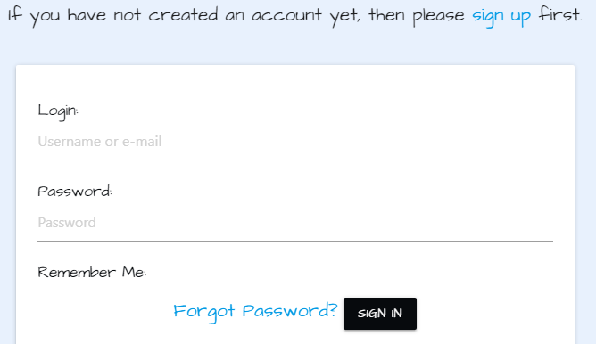

# Contents
* [UX](#UX)
    * [Strategy](#Strategy)
       * [Project Goals](#Project-Goals)
       * [User Stories](#User-Stories) 
    * [Structure](#Structure)
       * [Existing Features](#Existing-Features) 
            * [Features on all pages](#Features-on-all-pages)
            * [Home Page Features](#Home-Page-Features)
            * [Login Page Features](#Login-Page-Features)
            * [Sign-Up Page Features](#Sign-Up-Page-Features)
            * [Profile Page Features](#Profile-Page-Features)
            * [Log Out Features](#Log-Out-Features)
            * [404 Page](#404-Page)
            * [500 Page](#500-Page)
            * [Features exclusive to Admin](#Features-exclusive-to-Admin)         
       * [Features Left To Implement](Feature-Left-To-Implement)  
       * [Design](#Design)
            * [Colors](#Colors)
            * [Typography](#Imagery)
            * [Imagery](#Imagery)    
    * [Skeleton](#Skeleton)
      * [Wireframes](#Wireframes)
      * [Database Schema](#Database-Schema)
      * [Sitemap](#Sitemap)
    * [Technolgies Used](#Technologies-Used)
    * [Testing](#Testing)
    * [Deployment](#Deployment)
      * [Deployment Steps](#Deployment-Steps) 
      * [Making a clone to run locally](#Making-a-clone-to-run-locally)
      * [How to Fork the respository](#How-to-Fork-the-Respository)
    * [Credits](#Credits)
      * [Media](#Media)
      * [Content](#Content)
      * [Code](#Code)
      * [Acknowledgements](#Acknowledgements)

# Joyce English School


The live website can be viewed [here](https://joyce-english-school.herokuapp.com/)


# UX

## Strategy

### Project Goals
The primary goal of this site is to facillitate people in the city of Trieste who have a desire to learn English. For the purpose of this project all site content has been presented in English but in a real world application this site would be presented in Italian. The site is named after famed Irish author James Joyce who lived in Trieste for many years and is still revered by the city's inhabitants today. Coincidentially James Joyce also taught English as a foreign language in the city of Trieste. The site is designed to offer user's the opportunity to find out information about the school's courses and also to allow registered user's to purchase courses from the site. Users can also read and leave reviews, view the order history and create a profile with the site. There are many other site features to be implemented which will be discussed in depth later on in this document. 


**The Ideal User of this site:**
* is someone with a desire to learn English.
* is a parent of a child who needs assistance learning English. 
* is someone who wishes to gain an English language certification.
* is a business owner who wishes to improve their staffs English skills.
* is a parent of a teenager who wishes to book extracuricular English lessons to supplement their secondary 
school education. 
  

### User Stories

* As a first time user I want to know the site's purpose immediately upon arrival.
* As a first time user I want to access reviews of the school to inform my decision before signing up for a course.
* As a first time user I want the site UX to be intuitive for ease of use.
* As a first time user I want to find information about English language courses in the city of Trieste.
* As a user I want the site to be responsive across all devices.
* As a user I want to be able to create an account easily.
* As a user I want to be able to choose an exam course based on my level of English easily.
* As a user I want to recieve email confirmation that my payments have been successful. 
* As a user I want to be able to pay for courses using a secure credit card payment system.
* As a returning user I want to be able to leave reviews of my experience with the school.
* As a returning user I want be able to contact the school easily for any further enquires I may have.
* As a business owner/working professional I want to be able to sign-up for Business English classes. 
* As an existing user I want to be able to update my profile information easily.
* As an existing user I want to be able to access my order history easily. 
* As a parent I want to be able to sign my children up for appropriate courses based on their age and have the option of
continuning their education over the summer through an English language based summer camp.
* As a user with limited time I want the opportunity to take an intensive English language course before moving to an English speaking country or returning to school for the academic year. 

### User Stories - Admin Only
* As a site administrator I want to be able to create, update and delete course information/course options. 
* As a site administrator I want to be able to edit or delete reviews that may contain inappropriate content. 
* As a site administrator I want to have a simple payment system so that users have no problem making purchases.
* As a site adminstrator I want to prevent unauthorized users from having access to Admin content and other users profiles.


# Structure

## Existing Features

### Features on all pages:
* Navbar
* Footer
* Social Media Icons

### Home page features:

* A parallax container displays the two images described in the Design section below.
* A card is displayed to the user describing the site's purpose. 
* If the user is not signed in there are three call to action buttons, one which invites the user to register an account with the site, another which invites the user to read reviews about the school and another which asks current users to sign in as seen in the image below. 


* If the user is  signed in there are three call to action buttons, one which invites the user to make an article contribution, visit the articles page or visit the topics page to promote easy of use.


### Login page features:

* A parallax container displays the two images described in the Design section below. 
* A Log in form is presented to the user which asks for their username and password which are validated by django allauth. An image of the login form can be seen below.



### Sign-Up page features:
* A parallax container displays the two images described in the Design section below. 
* A register form is presented to the user which asks for their username, email address and password which are validated by Django allauth. The password must be declared twice to ensure it matches or else the user will be notified that their passwords do not match. This is done to ensure that the user has input a password that they are familiar with and can remember and to avoid any possible typos that could hinder the user from signing in in the future. The user will then be redirected to a page which instructs them to verify their email address. Once this is done they will be brought to a page which asks them to confirm their email address and finally they will be redirected to the login page where they can login with their newly created credentials. An image of the registration form can be seen below.

* 

* 

* 


### Profile page features:
* A profile page is automatically create for the user once they have registered with the site. The profile form is automatically updated with the information input from the checkout form after the user has made a purchase. The user can update this information at any time but editing it in their profile page. Beneath the profile form there is a table with the user's order history. The user is able to click the order number in the order history section to view an more in depth description of a particular order. 

* 

* 

* 

* 

### Logout features:
* The log out button directs the user to the signout page which asks the user to confirm that they wish to sign out. There are also three call to action cards on the sign out page to encourage the user to remain on the site for longer. Once a user clicks the signout button the user's session cookie will be removed from the app and the user will be redirected home page.

* 

* 

### 404 Page
* A 404 Page has been created in order to deal with user errors in navigation or invalid search data in order to assist the user in returning to the home page. All navigation features are present on the 404 page as well as a button labeled 'home' in order to easily redirect the user back to the relevant page.


### 500 Page 
* A 500 page has been created to deal with any potential internal server errors.


### Features exclusive to Admin:

* Only the Admin can edit/delete all articles content on the site, otherwise the content must belong to the session user in order for it to be edited or deleted. 
* Only Admin can add new topics to the topics page.
* Only Admin can edit/delete existing topics on the topics page.
* Only Admin can add new material to the further reading page.
* Only Admin can edit/delete material on the further reading page.


## Features left to implement


## Design

### Colors

* The colors of this site were chosen in order to replicate the feel of old newspapers and books. It's a simple black and white monochrome palette coupled with shades of grey so as not to overwhelm the user and to adhere to the principles of good UX design. They match the monochrome images that have been selected for this site. 

This palette was created on the [Coolors Website](https://coolors.co).


### Typography
* The 'Metal Mania' font was chosen for header text because of its striking style and historical feel as well as it's clarity. Other fonts that were found were perhaps more fitting in terms of how frequently they were used in the past but in order to stick with the principles of good UX the aforementioned font was chosen based on its readability.


* The 'IM Fell English SC' was chosen based on its similarity to the text often found in older literature in order to enhance the historic feel of the site and promote a positive user experience.


* Both fonts were found on [Google Fonts](https://fonts.google.com/)


### Imagery


## Skeleton

### Wireframes

* The wireframes were created using [Balsamiq wireframes](https://balsamiq.com/)

* The wireframe mockup links can be found below:

* [Home Page Wireframes](documentation/wireframes/MS4-home-wireframe.pdf)

* [Courses Page Wireframes](documentation/wireframes/MS4-courses-wireframe.pdf)

* [Contact Page Wireframes](documentation/wireframes/MS4-contact-wireframe.pdf)

* [Register Page Wireframes](documentation/wireframes/MS4-register-wireframe.pdf)

* [Profile Page Wireframes]()

* [Login Page Wireframes](documentation/wireframes/MS4-login-wireframe.pdf)

* [Who we are Page Wireframes](documentation/wireframes/MS4-who-we-are-wireframe.pdf)


### Database Schema


* A relational database was used to create this project. During production SQLite was used as the site's database and all data was migrated to Heroku Postgres during deployment to Heroku. The key models can be seen in the image above and are described in depth below:

#### Key Models 

**Courses** 
- This model alongside the exam_courses model are the foundation of the site's purpose. This model stores all relevant information about what each individual course offers.
- The price is stored in this model. 
- Each individual course contains it's own unique description and each course is referenced using a Primary Key which is generated each time a new course is created. 
- This model also stores information regarding course start and end dates and also the number of class hours that will be allocated for the duration of the course. 
- The assigned course images are also stored in this model. 

**Exam Courses**
- The exam_course model follows almost the exact same configuration as the course model aside from a few small differences.
- English exam courses require a specific level of English before a student can comfortably join a specific exam course. The `required_level` field informs the user of the necessary level of English needed for a particular exam course and the `certification_awarded` field informs the user of the certification they will be working towards should they chose to undertake a particular exam course.

**OrderLineItem**
- This model stores an instance of a course along with the `lineitem_total` which updates the price in the checkout. 

**Order**
- This model stores the information that is often expected to be found in an order, namely, the user, billing information, address information, the date of the transaction, the user's contact information and the `stripe_pid`.

**UserProfile**

- This model is created for each user when they register with the site. It stores the user's relevant profile information in the checkout form after their first purchase to allow for quicker and more convenient future purchases. 

- It is also connected to the allauth User model when a user registers with the site. 

- It connects with the `review_creator` field in the reviews model. 

**Reviews**
- This model allows the user to have their own CRUD functionality on the site. It connects to the UserProfile in the `review_creator` and allows the user to add their own reviews to the site by storing them in the database through the `comments` field of the model. It also stores the date of the review so that other users can tell how recent and relevant an individual review is. 


## Technologies Used
- This project is primarily built using HTML5 semantic markup, CSS stylesheets, Javascript, Python, Django, SQLite and Heroku Postgres.
- [Python](https://www.python.org/) 
    - The following Python modules were used on this project:
       - asgiref==3.4.1
       - boto3==1.18.53
       - botocore==1.21.53
       - crispy-forms-materialize==0.2
       - dj-database-url==0.5.0
       - Django==3.2.6
       - django-allauth==0.41.0
       - django-crispy-forms==1.12.0
       - django-storages==1.11.1
       - gunicorn==20.1.0
       - jmespath==0.10.0
       - oauthlib==3.1.1
       - Pillow==8.3.1
       - psycopg2-binary==2.9.1
       - python3-openid==3.2.0
       - pytz==2021.1
       - requests-oauthlib==1.3.0
       - s3transfer==0.5.0
       - sqlparse==0.4.1
       - stripe==2.60.0

- [Django](https://docs.djangoproject.com/en/3.1/)
    - Django was used as the main python framework in the building of this project.
- [jQuery](https://jquery.com/)
    - This framework was used to create some of the site's interactive functions.
- [Gitpod](https://gitpod.io)
    - This project was built using Gitpod as the IDE.
- [Github](https://github.com/)
    - Github was used for online version control and storing files and documents.
- [Heroku](https://id.heroku.com/)
    - Heroku was used as a cloud based platform to deploy this site.
- [Google fonts](https://fonts.google.com/) 
    - The font styles used on this website were chosen from Google fonts.
- [Materializecss](https://materializecss.com/)
   - Various aspects of this website were structured using Materialize.
   - Materialize was used to make this website responsive
- [Fontawesome](https://fontawesome.com/)
    - The icons used on this page were found in Fontawesome.
- [SQLite](https://www.sqlite.org/index.html)
    - SQLite was used as the database for the creation and development of this project.
- [Heroku Postgres](https://www.heroku.com/postgres)
    - Heroku was used as the database for this project in production mode after deployment to Heroku.
- [Jinja](https://jinja.palletsprojects.com/en/3.0.x/)
    - Jinja was used for templating.
- [Stripe](https://stripe.com/ie)
    - Stripe payments was used to build the card payment system of this site.
- [AWS-Amazon Web Services](https://aws.amazon.com/)
    - AWS was used to store all media and static files of this site in production mode.    
- [Balsamiq](https://balsamiq.com/)
    - The wireframes for this project were created using Balsamiq.
 - [Freeformatter- CSS beautifier](https://www.freeformatter.com/css-beautifier.html)
    - This was used to format the CSS stylesheet.
- [Freeformatter- HTML formatter](https://www.freeformatter.com/html-formatter.html)
    - This was used to format each HTML page
- [PEP8online](http://pep8online.com/)
    - PEP8 online was used to make sure all python code was pep8 compliant.
- [Google DevTools](https://developers.google.com/web/tools/chrome-devtools) 
    - Google Dev Tools was extensively used throughout the project for various styling and testing purposes. Its lighthouse feature was used as one of the main testing tools for this project.
- [EmailJS](https://www.emailjs.com/)
    - The contact-form was created using EmailJS following a code institute tutorial.
- [CSS-Tricks](https://css-tricks.com/)
    - This was used as a general reference resource.
- [Favicon.io](https://favicon.io/) 
    - This was used to create the site's favicon.
- [Am I Responsive](http://ami.responsivedesign.is/)
    - This was used to test the responsiveness of the site and also to create the mock-up image presented at the start of this document.
- [Beautifier.io](https://beautifier.io/)
    - Beautifier.io was used to format all javascript files in this project.
- [Dbdiagram.io](https://dbdiagram.io/home)
    - Dbdiagram.io was used to create the Database Schema presented in this document.
- [Coolors.co](https://coolors.co/)
    - Coolors.co was used to create the project's color palette.
- [StackOverflow](https://stackoverflow.com/)
    - Stack Overflow was used as a general reference resource. 

## Testing
Testing information can be found here in the separate [TESTING.md file](TESTING.md)

## Deployment
This project was developed using [Gitpod IDE](https://gitpod.io) and pushed to Github using the in-built terminal. However, because Github can only host static websites it was necessary to deploy this project to Heroku because it is a compatible hosting platform for a back-end focused site like Joyce English School. The master branch of this repository is the most current version and has been used for the deployed version of the site.

The Code Institiue student template was used to create this project.

[Code Institute Full Template](https://github.com/Code-Institute-Org/gitpod-full-template)

This project was deployed using Heroku and stored in GitHub.

### Project and Repository Creation

1. Navigate to [Github](https://github.com/).
2. Create a new repository by first clicking the green button labelled new on the top left of the screen.
3. Select the Code Institute template in the templates section.
4. Give the repository a name, in this case Joyce-English-School-MS4.
5. Click the green 'Create Repository' button at the bottom of the page.
6. Inside the repository click the green 'gitpod' button to initialize your repository.
8. Future access to this workspace must be gained through gitpod workspaces, clicking the green button in gitpod again 
will initialize a new workspace.
9. Use the `git add .` command to add all modified and new files to the staging area.
10. Use the `git commit -m` command to commit change to the local repository.
11. Use the `git push` command to push all committed changes to github.   

Before deploying the website to Heroku, the following three must be followed to allow the app to work in Heroku:
1. Create requirements.txt file that contains the names of packages being used in Python. It is important to update this file if other packages or modules are installed during project development by using the following command:

    - pip freeze --local > requirements.txt

2. Create Procfile that contains the name of the application file so that Heroku knows what to run. If the Procfile has a blank line when it is created remove this as this may cause problems.

3. Push these files to GitHub.

4. Install `psycopg2` and `dj_datatbase_url` in your workspace cli.

Once those steps are done, the website can be deployed in Heroku using the steps listed below:

### Deployment Steps

1. Log into Heroku .
2. Click the New button.
3. Click the option to create a new app.
4. Enter the app name in lowercase letters.
5. Select the correct geographical region.

### Connect Heroku app to Github repository

1. In heroku select the deploy tab.
2. Click github button.
3. Enter the repository name and click search.
4. Select the relevant repository and click connect. 

### Add Heroku Postgres Database
1. Click the resources tab in heroku.
2. Under Add-ons search for heroku postgres.
3. Click on heroku postgres when it appears. 
4. Select the Hobby Dev-Free option in plans. 
5. Click submit order form.

### Setting up environment variables
1. In the heroku settings click the reveal config vars button and set the following variables:
    - AWS_ACCESS_KEY_ID
    - AWS_SECRET_ACCESS_KEY
    - DATABASE_URL
    - EMAIL_HOST_PASS
    - EMAIL_HOST_USER
    - SECRET_KEY
    - STRIPE_PRICE_ID
    - STRIPE_PUBLIC_KEY
    - STRIPE_SECRET_KEY
    - STRIPE_WH_SECRET
    - USE_AWS

- The values of these variables are secret and for security purposes will not be shared here. 

### Setting up the AWS s3 bucket
1. Create an Amazon AWS account
2. Search for S3 and create a new bucket
    - Allow public access
3. Under Properties > Static website hosting
    - Enable
    - index.html as index.html
    - save
4. Under Permissions > CORS use the following:
```
[
  {
      "AllowedHeaders": [
          "Authorization"
      ],
      "AllowedMethods": [
          "GET"
      ],
      "AllowedOrigins": [
          "*"
      ],
      "ExposeHeaders": []
  }
]
```
5. Under Permissions > Bucket Policy:
    - Generate Bucket Policy and take note of Bucket ARN
    - Chose S3 Bucket Policy as Type of Policy
    - For Principal, enter *
    - Enter ARN noted above
    - Add Statement
    - Generate Policy
    - Copy Policy JSON Document
    - Paste policy into Edit Bucket policy on the previous tab
    - Save changes
6. Under Access Control List (ACL):
    - For Everyone (public access), tick List
    - Accept that everyone in the world may access the Bucket
    - Save changes

**AWS IAM (Identity and Access Management) setup**
1. From the IAM dashboard within AWS, select User Groups:
    - Create a new group
    - Click through and Create Group
2. Select Policies:
    - Create policy
    - Under JSON tab, click Import managed policy
    - Choose AmazongS3FullAccess
    - Edit the resource to include the Bucket ARN noted earlier when creating the Bucket Policy
    - Click next step and go to Review policy
    - Give the policy a name and description of your choice
    - Create policy
3. Go back to User Groups and choose the group created earlier
    - Under Permissions > Add permissions, choose Attach Policies and select the one just created
    - Add permissions
4. Under Users:
    - Choose a user name 
    - Select Programmatic access as the Access type
    - Click Next
    - Add the user to the Group just created
    - Click Next and Create User
5. Download the `.csv` containing the access key and secret access key.
    - **THE `.csv` FILE IS ONLY AVAILABLE ONCE AND CANNOT BE DOWNLOADED AGAIN.**

**Connecting Heroku to AWS S3**
1. Install boto3 and django-storages
```
pip3 install boto3
pip3 install django-storages
pip3 freeze > requirements.txt
```
2. Add the values from the `.csv` you downloaded to your Heroku Config Vars under Settings:
3. Delete the `DISABLE_COLLECTSTATIC` variable from your Cvars and deploy your Heroku app
4. With your S3 bucket now set up, you can create a new folder called media (at the same level as the newly added static folder) and upload any required media files to it.
    - **PLEASE MAKE SURE `media` AND `static` FILES ARE PUBLICLY ACCESSIBLE UNDER PERMISSIONS**


### Enable automatic deployment:

1. Click the Deploy tab
2. In the Automatic deploys section, choose the branch you want to deploy from then click Enable Automation Deploys.


### Connect app to Github Repository

1. Click the deploy tab and connect to GitHub.
2. Type the name of the repository into the search bar presented.
3. Click the Code dropdown button next to the green Gitpod button.
4. When the correct repository displays click the connect button.

### Making a clone to run locally

It is important to note that this project will not run locally unless an env.py file has been set up by the user which contains the IP, PORT, MONGO_DBNAME, MONGO_URI and SECRET_KEY which have all been kept secret in keeping with best security practices. 

1. Log into GitHub.
2. Select the [respository](https://github.com/AideenM12/Joyce-English-School-MS4).
3. Click the Code dropdown button next to the green Gitpod button.
4. Download ZIP file and unpackage locally and open with IDE. Alternatively copy the URL in the HTTPS box.
5. Open the alternative editor and terminal window.
6. Type 'git clone' and paste the copied URL.
7. Press Enter. A local clone will be created.

Once the project been loaded into the IDE it is necessary to install the necessary requirements which can be done by typing the following command.

    -pip install -r requirements.txt

### How to Fork the respository.

1. Log into GitHub.
2. In Github go to (https://github.com/AideenM12/Joyce-English-School-MS4).
3. In the top right hand corner click "Fork".


---


## Credits

### Media
The image used to create the James Joyce favicon was originally obtained from [trybooking.com](https://www.trybooking.com/events/landing?eid=751940&)

Books.jpg https://unsplash.com/photos/IOzk8YKDhYg?utm_source=unsplash&utm_medium=referral&utm_content=creditShareLink
flag.jpg Image by <a href="https://pixabay.com/photos/?utm_source=link-attribution&amp;utm_medium=referral&amp;utm_campaign=image&amp;utm_content=1209605">Free-Photos</a> from <a href="https://pixabay.com/?utm_source=link-attribution&amp;utm_medium=referral&amp;utm_campaign=image&amp;utm_content=1209605">Pixabay</a>

pages.jpg Image by <a href="https://pixabay.com/users/kranich17-11197573/?utm_source=link-attribution&amp;utm_medium=referral&amp;utm_campaign=image&amp;utm_content=6213537">Kranich17</a> from <a href="https://pixabay.com/?utm_source=link-attribution&amp;utm_medium=referral&amp;utm_campaign=image&amp;utm_content=6213537">Pixabay</a>

teenagers.jpg https://unsplash.com/photos/8nHQx4zi9Wk

children.jpg https://unsplash.com/photos/o_lLsdVTxak

business-class.jpg https://unsplash.com/photos/FDV1BaKNKEo

adults.jpg https://unsplash.com/photos/XkKCui44iM0

summer-camp.jpg https://www.pexels.com/photo/man-people-woman-weather-8033897/

questions.jpg https://pixabay.com/illustrations/ask-writing-who-what-how-why-2245264/

intensive-courses.jpg https://pixabay.com/photos/girl-english-dictionary-read-2771936/

exams.jpg https://unsplash.com/photos/s9CC2SKySJM
### Content


### Code


* The email.js code was sourced from Matt Rudge's Code Institute tutorial on the same subject.

* A large portion of this project's code was inspired by Chris Zielinski's Boutique Ado project walkthrough tutorial. This Code Institute tutorial was instrumental in the creation of this site. 

* The TESTING.md section of this project was inspired by my classmate, Daisy McGirr's, workshop on testing. This workshop proved very useful for a great deal of students, myself included, in approaching all matters of testing. 

### Acknowledgements

* I would firstly like to thank my ever-patient mentor, Aaron Sinnott, whose guidance, knowledge and calm advice has been integral to the creation, development and completion of this project. 

* I would like to thank the entire slack community for being a source of support, knowledge and positive feedback throughout this project, in particular data-centric-dev channel lead Ed B who seemed to be constantly available to answer questions and troubleshoot solutions with students throughout the development of their third milestone projects.

* I would like to thank Daisy McGirr for taking time out of her busy schedule to provide us with the aforementioned testing workshop and for constantly offering encouragement and help to our Springboard class throughout our Code Institute journey.

* I would like to thank my own Springboard class cohorts for being supportive and helpful throughout the duration of the course. This particular channel provided a great deal of respite and also necessary feedback throughout the course which has proven invaluable for maintaining motivation. 

* Finally I would like to thank my boyfriend Shane for constantly helping to test the project throughout its development, providing insightful suggestions as to how to improve user experience. And also for helping to proof read this document and ensure it meets the correct standards of grammar, spelling and readability.