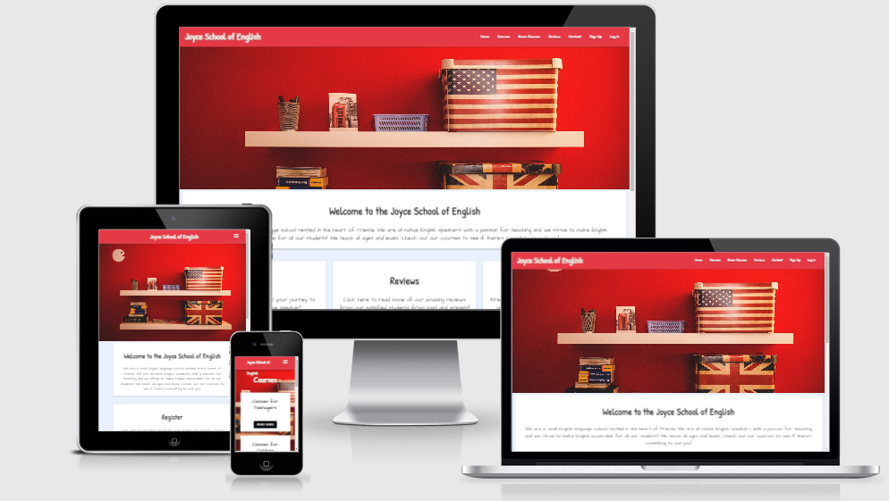
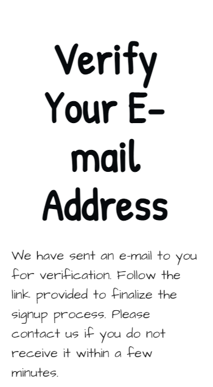
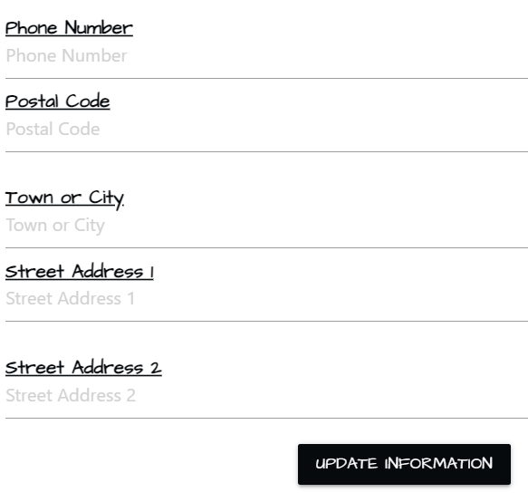
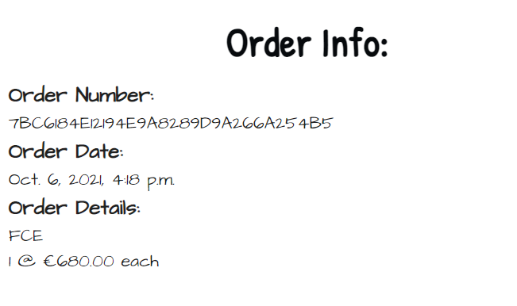
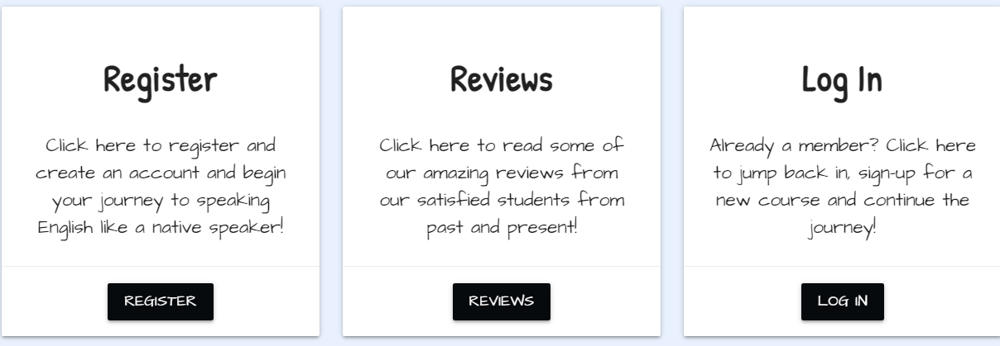
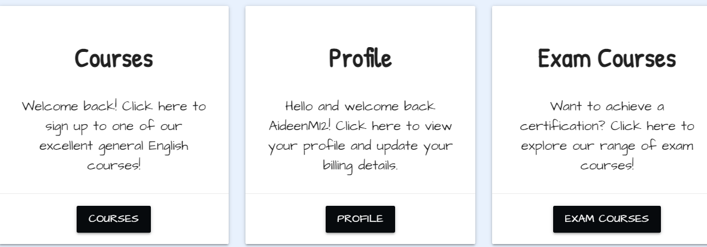
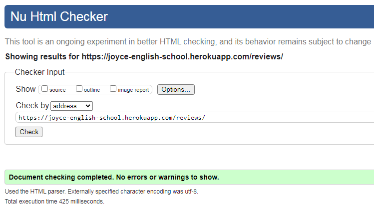

# Contents

   * [Testing User Stories](#Testing-User-Stories)
        * [Test Case 1](#Test-Case-1)
        * [Test Case 2](#Test-Case-2)
        * [Test Case 3](#Test-Case-3)
        * [Test Case 4](#Test-Case-4)
        * [Test Case 5](#Test-Case-5)
        * [Test Case 6](#Test-Case-6)
        * [Test Case 7](#Test-Case-7)
        * [Test Case 8](#Test-Case-8)
        * [Test Case 9](#Test-Case-9)
        * [Test Case 10](#Test-Case-10)
        * [Test Case 11](#Test-Case-11)
        * [Test Case 12](#Test-Case-12)
        * [Test Case 13](#Test-Case-13)
        * [Test Case 14](#Test-Case-14)
        * [Test Case 15](#Test-Case-15)
        * [Test Case 16](#Test-Case-16)
        * [Test Case 17](#Test-Case-17)
   * [Testing User Stories - Admin Only](#Testing-User-Stories-Admin-Only)       
        * [Test Case 18](#Test-Case-18)
        * [Test Case 19](#Test-Case-19)
        * [Test Case 20](#Test-Case-20)
        * [Test Case 21](#Test-Case-21)
   * [Testing Features](#Testing-Features)
        * [Navigation](#Navigation)
        * [Footer](#Footer)        
        * [Social Media Links](#Social-Media-Links)
        * [Home Page Features](#Home-Page-Features)
        * [Courses Page Features](#Courses-Page-Features)
        * [Login Page Features](#Login-Page-Features)
        * [Sign-Up Page Features](#Sign-Up-Page-Features)
        * [Profile Page Features](#Profile-Page-Features)
        * [Review Page Features](#Review-Page-Features)
        * [Further Reading Page Features](#Further-Reading-Page-Features)  
        * [Log Out Features](#Log-Out-Features)
        * [404 Page](#404-Page)
        * [500 Page](#500-Page)
        * [Features exclusive to Admin](#Features-exclusive-to-Admin)
   * [Validators](#Validators)
        * [HTML Validators](#HMTL-Validators)
            * [HTML Pages](#HTML-Pages)
            * [Data Sensitive HTML Pages](#Data-Sensitive-HTML-Pages)
        * [CSS](#CSS)
        * [Javascript](#Javascript)
   * [Manual Testing of Route Handlers](#Manual-Testing-of-Route-Handlers)
       * [Edit Article Route Handler](#Edit-Article-Route-Handler)
       * [Add Topic Route Handler](#Add-Article-Route-Handler)
       * [Edit Topic Route Handler](#Edit-Article-Route-Handler)
       * [Add Further Reading Route Handler](#Add-Further-Reading-Route-Handler)
       * [Edit Further Reading Route Handler](#Edit-Further-Reading-Route-Handler)
   * [Known Bugs and Issues](#Known-Bugs-and-Issues)
   * [Further Testing](#Further-Testing) 

## Testing User Stories

### Test Case 1

> As a first-time user I want to know the site's purpose immediately upon arrival.

**Description**
Verify that the site's purpose is explicitly clear when a user navigates to the site landing page.

**Steps**
1. Open one's internet browser of choice.
2. Navigate to [https://joyce-english-school.herokuapp.com/](https://joyce-english-school.herokuapp.com/)
3. Scroll to the content directly beneath the site's first image.
4. Read the site description directly beneath the image in order to understand the site's purpose.

**Expected Result:**
A card container with text explaining the site's purpose will be displayed beneath the first image.

**Actual Result:**
A card container with text explaining the site's purpose is displayed beneath the first image.

**Pass/Fail:**
Pass

**Image of Test Result:** 


---

### Test Case 2

> As a first-time user I want to access reviews of the school to inform my decision before signing up for a course.

**Description**
Verify that the site offers users access to the reviews page without having to register.

**Steps**
1. Open one's internet browser of choice.
2. Navigate to [https://joyce-english-school.herokuapp.com/](https://joyce-english-school.herokuapp.com/)
3. Select the reviews tab in the navigation bar.
4. Observe the various reviews of other site users.


**Expected Result:**
 The user will be able to navigate to the reviews section and read other users' reviews without registering. 

**Actual Result:**
The user is able to navigate to the reviews section and read other users' reviews without registering. 

**Pass/Fail:**
Pass

**Image of Test Result:** 


---

### Test Case 3

>  As a first-time user I want the site UX to be intuitive for ease of use.

**Description**
Verify that the site provides the user with an intuitively designed navigation bar and footer.

**Steps**
1. Open one's internet browser of choice.
2. Navigate to [https://joyce-english-school.herokuapp.com/](https://joyce-english-school.herokuapp.com/)
3. Select the tab of choice in the navigation bar.
4. Alternatively create an account for a greater depth of user experience.
5. Use the navigation and footer links to explore the site and find desired content/services.
6. Logout once site exploration has concluded.

**Expected Result:**
A navigation bar will provide the user with links to the site's content that they can use intuitively. A series of footer icons will provide the user with links to the site's social media accounts.

**Actual Result:**
A navigation bar provides the user with links to the site's content that they can use intuitively. A series of footer icons provide the user with links to the site's social media accounts.

**Pass/Fail:**
Pass

**Image of Test Result:** 


---

### Test Case 4

> As a first-time user I want to find information about English language courses in the city of Trieste.

**Description**
Verify that the site provides the user with information regarding English language courses in the city of Trieste. 

**Steps**
1. Open one's internet browser of choice.
2. Navigate to [https://joyce-english-school.herokuapp.com/](https://joyce-english-school.herokuapp.com/)
3. Navigate to the courses or exam courses page of the site.
4. Click on the "Read More" button of the desired course for more information. 
5. Observe all the necessary information regarding the course details.


**Expected Result:**
A detailed description page of the course will provide the user with all the necessary information regarding their course of choice.

**Actual Result:**
A detailed description page of the course will provide the user with all the necessary information regarding their course of choice.

**Pass/Fail:**
Pass

**Image of Test Result:** 


---

### Test Case 5

> As a user I want the site to be responsive across all devices.


**Description**
Verify that the site is responsive on all devices.

**Steps**
1. Open one's internet browser of choice on one's device of choice.
2. Navigate to [[https://joyce-english-school.herokuapp.com/](https://joyce-english-school.herokuapp.com/)
3. Test the responsiveness of the site on each available device.
4. Document the results.

**Expected Result:**
The site will be responsive across all available devices.

**Actual Result:**
* The website was primarily tested on the following devices:

    - Hp Pavilion g series laptop
    - Samsung A10

* Other devices used for site testing include:

    - HP 250 G6 Notebook PC 
    - Huawei P smart 2020
    - Iphone SE
    - Samsung A70

* Other tests performed to determine site responsiveness were conducted using google Dev Tools in order to view the site on a variety of devices. The [Am I Responsive](http://ami.responsivedesign.is/) website was also used to test the visual presentation of the site on different devices.

**Pass/Fail:**
Pass

**Image of Test Result:** 



---

### Test Case 6

> As a user I want to be able to create an account easily.

**Description**
Verify that the site provides the user with an opportunity to create an account easily. 

**Steps**
1. Open one's internet browser of choice.
2. Navigate to [https://joyce-english-school.herokuapp.com/](https://joyce-english-school.herokuapp.com/).
3. Click the Sign-Up tab in the navigation bar. Alternatively, click the register button beneath the banner image.  
4. Fill out the the registration form as instructed.
5. Verify email address as instructed.
6. Log in with the credentials that were created when filling out the registration form. 


**Expected Result:**
A registration form will be provided and once successfully completed and submitted the user will receive an email asking them to verify their account. Once the user's email has been verified they will be able to log in easily with the credentials they have created. 

**Actual Result:**
A registration form will be provided and once successfully completed and submitted the user will receive an email asking them to verify their account. Once the user's email has been verified they will be able to log in easily with the credentials they have created. 

**Pass/Fail:**
Pass

**Image of Test Result:** 

* 

* 

* 

* 

---

### Test Case 7

> As a user I want to be able to choose an exam course based on my level of English easily.

**Description**
Verify that the site offers exam courses for a broad range of levels. 

**Steps**
1. Open one's internet browser of choice on one's device of choice.
2. Navigate to [https://joyce-english-school.herokuapp.com/](https://joyce-english-school.herokuapp.com/)
3. Select the exam courses tab.
4. Observe the range of exam courses offered and the level required for each exam course. 
5. Select the exam course appropriate to the user's level of English. 

**Expected Result:**
The exam courses page will offer a wide variety of exam courses for all levels.

**Actual Result:**
The exam courses page offers a wide variety of exam courses for all levels.

**Pass/Fail:**
Pass

**Image of Test Result:** 


---
### Test Case 8

> As a user I want to receive email confirmation that my payments have been successful

**Description**
Verify that the site provides the user with receives a confirmation email after a payment.

**Steps**
1. Open one's internet browser of choice.
2. Navigate to [https://joyce-english-school.herokuapp.com/](https://joyce-english-school.herokuapp.com/)
3. Select the Log In tab in the navigation bar.
4. Enter user's log in details. 
5. Navigate to the Courses/Exam Courses page.
6. Click the "Read More" on the desired Course. 
7. Click the "Add to Cart" button beneath the course's description.
8. Navigate to the Cart page.
9. Click the "Secure Checkout" beneath the course description card.
10. Fill out the payment form as instructed.
11. Observe the checkout success page with the order details and the confirmation email in the user's email inbox.


**Expected Result:**
The site will provide the user with receives a confirmation email after a payment

**Actual Result:**
The site provides the user with receives a confirmation email after a payment

**Pass/Fail:**
Pass

**Image of Test Result:** 

* 

---

### Test Case 9

> As a user I want to be able to pay for courses using a secure credit card payment system.

**Description**
Verify that the site provides the user is able to make payments using a secure and simple card payments system. 

**Steps**
1. Open one's internet browser of choice.
2. Navigate to [https://joyce-english-school.herokuapp.com/](https://joyce-english-school.herokuapp.com/)
3. Select the Log In tab in the navigation bar.
4. Enter user's log in details. 
5. Navigate to the Courses/Exam Courses page.
6. Click the "Read More" on the desired Course. 
7. Click the "Add to Cart" button beneath the course's description.
8. Navigate to the Cart page.
9. Click the "Secure Checkout" beneath the course description card.
10. Fill out the payment form as instructed.
11. Observe the checkout success page with the order details


**Expected Result:**
The checkout system will be secure and simplistic for ease of use.

**Actual Result:**
The checkout system is secure and simplistic for ease of use.

**Pass/Fail:**
Pass

**Image of Test Result:** 


---

### Test Case 11

> As a returning user I want to be able to leave reviews of my experience with the school.

**Description**
Verify that the site provides the user with the ability to leave reviews of their experience with the school.

**Steps**
1. Open one's internet browser of choice.
2. Navigate to [https://joyce-english-school.herokuapp.com/](https://joyce-english-school.herokuapp.com/)
3. Select the Log In tab in the navigation bar.
4. Enter user's log in details. 
5. Navigate to the reviews page.
6. Scroll to the bottom of the reviews.
7. Click the 'Create Review' button. 
8. Fill out the form as instructed and click the 'Add Review' button.
9. Observe the recently created review at the top of the page.


**Expected Result:**
The user will be able to successfully leave a review of their experience of the school.

**Actual Result:**
The user is able to successfully leave a review of their experience of the school.

**Pass/Fail:**
Pass

**Image of Test Result:** 

* 

* 

* 
---

### Test Case 12

> As a returning user I want to be able to contact the school easily for any further enquiries I may have.

**Description**
Verify that the site provides the user with the ability to contact the school.

**Steps**
1. Open one's internet browser of choice.
2. Navigate to [https://joyce-english-school.herokuapp.com/](https://joyce-english-school.herokuapp.com/)
3. Navigate to the contact page.
4. Fill out the contact form as instructed.
5. Observe the 'thank you' message that confirms the school has received the user's message. 

**Expected Result:**
The user will be easily able to contact the school through the site's contact page.

**Actual Result:**
The user is easily able to contact the school through the site's contact page.

**Pass/Fail:**
Pass

**Image of Test Result:** 

* 

* 

---

### Test Case 13

> As a business owner/working professional I want to be able to sign-up for Business English classes. 

**Description**
Verify that the site provides the user with the option of purchasing business English classes.

**Steps**
1. Open one's internet browser of choice.
2. Navigate to [https://joyce-english-school.herokuapp.com/](https://joyce-english-school.herokuapp.com/)
3. Select the Log In tab in the navigation bar.
4. Enter user's log in details. 
5. Navigate to the courses page.
6. Click the 'Read more' button on the 'classes for businesses' card.
7. Observe the description of business English classes offered by the school.


**Expected Result:**
The site will offer the user the ability to study business English.

**Actual Result:**
The site will offer the user the ability to study business English.

**Pass/Fail:**
Pass

**Image of Test Result:** 

* 

* 

---


### Test Case 14
> As an existing user I want to be able to update my profile information easily.

**Description**
Verify that the site provides the user with the ability to update their profile information. 

**Steps**
1. Open one's internet browser of choice.
2. Navigate to [https://joyce-english-school.herokuapp.com/](https://joyce-english-school.herokuapp.com/)
3. Select the Log In tab in the navigation bar.
4. Enter user's log in details. 
5. Navigate to the user's profile page.
6. Fill out the form as instructed.
7. Click the 'Update Information' button.
8. Observe the updated profile information and the profile update notification.


**Expected Result:**
The user will be able to update their profile information easily.

**Actual Result:**
The user is able to update their profile information easily.

**Pass/Fail:**
Pass

**Image of Test Result:** 

* 

* 

---

### Test Case 15
> As an existing user I want to be able to access my order history easily. 

**Description**
Verify that the site provides the user with the ability to access their order history easily.

**Steps**
1. Open one's internet browser of choice.
2. Navigate to [https://joyce-english-school.herokuapp.com/](https://joyce-english-school.herokuapp.com/)
3. Select the Log In tab in the navigation bar.
4. Enter user's log in details. 
5. Navigate to the user's profile page.
6. Scroll to the order history section on the profile page. 
7. Click the order number to gain more information about a specific order.
8. Observe the details of the specific order. 


**Expected Result:**
The user will be able to access their order history easily.

**Actual Result:**
The user is able to access their order history easily.

**Pass/Fail:**
Pass

**Image of Test Result:** 

* 

* 

---

### Test Case 16
> As a parent I want to be able to sign my children up for appropriate courses based on their age and have the option of
continuing their education over the summer through an English language-based summer camp.

**Description**
Verify that the school offers classes for children and summer camps. 

**Steps**
1. Open your web browser of choice.
2. Navigate to [https://joyce-english-school.herokuapp.com/](https://joyce-english-school.herokuapp.com/)
3. Click the courses tab.
4. Observe the 'Classes for Children' and 'Summer Camps' cards.
5. Click the 'Read More' tab to learn more information about these courses and purchase these courses.

**Expected Result:**
The school will offer potential customers the ability to sign their children up for classes and summer camps.

**Actual Result:**
The school offers potential customers the ability to sign their children up for classes and summer camps.

**Pass/Fail:**
Pass

**Image of Test Result:** 

* 

* 

---

### Test Case 17
> As a user with limited time I want the opportunity to take an intensive English language course before moving to an English-speaking country or returning to school for the academic year. 

**Description**
Verify that the school offers intensive courses.

**Steps**
1. Open your web browser of choice.
2. Navigate to [https://joyce-english-school.herokuapp.com/](https://joyce-english-school.herokuapp.com/)
3. Click the courses tab.
4. Observe the intensive courses card.
5. Click the 'Read More' tab to learn more information about this course and purchase this course.

**Expected Result:**
The school will offer the user the ability to sign up for intensive English courses.

**Actual Result:**
The school offers the user the ability to sign up for intensive English courses.


**Pass/Fail:**
Pass

**Image of Test Result:**


---
## Testing User Stories - Admin Only

### Test Case 18
> As a site administrator I want to be able to create, update and delete course information/course options.

**Description**
Verify that 

**Steps**
1. Open your web browser of choice.
2. Navigate to [https://joyce-english-school.herokuapp.com/](https://joyce-english-school.herokuapp.com/)
3. Click the login tab.
4. Log in as a superuser.
5. To add a new course click the site management tab and select which type of course to add.
6. To edit a course simply click on the course and select the edit button beneath the course and fill out the form as instructed.
7. To delete a course simply click on the course and select the delete button beneath the course.

**Expected Result:**
The site administrator will have the ability to create, update and delete course options.

**Actual Result:**
The site administrator has the ability to create, update and delete course options.


**Pass/Fail:**
Pass

**Image of Test Result:**

* 

* 

* 

---

### Test Case 19
>As a site administrator I want to be able to edit or delete reviews that may contain inappropriate content.

**Description**
Verify that the site administrator has the ability to delete inappropriate content on the reviews section of the site.

**Steps**
1. Open your web browser of choice.
2. Navigate to [https://joyce-english-school.herokuapp.com/](https://joyce-english-school.herokuapp.com/)
3. Navigate to the Admin view.
4. Log in as a superuser.
5. Navigate to the reviews section.
6. Click on the offending review.
7. Select the delete option and click delete.

**Expected Result:**
the site administrator will have the ability to delete inappropriate content on the reviews section of the site.

**Actual Result:**
The site administrator has the ability to delete inappropriate content on the reviews section of the site.

**Pass/Fail:**
Pass

---

### Test Case 20
> As a site administrator I want to have a simple payment system so that users have no problem making purchases.

* This particular user story has already been adequately tested in Test Case 9. Please refer back to [Test Case 9](#Test-Case-9) for further information.

---

### Test Case 21
> As a site adminstrator I want to prevent unauthorized users from having access to Admin content and other users' profiles.

* This particular user story will be explored in depth in the Testing Route Handlers section of this document. Please refer to the[Manual Testing of Route Handlers](#Manual-Testing-of-Route-Handlers) section for more information.

---

## Testing Features

### Navigation

**Description**
Verify that 

**Steps**
1. Open your web browser of choice.
2. Navigate to [https://joyce-english-school.herokuapp.com/](https://joyce-english-school.herokuapp.com/)
3. As an unsigned-in user click each of the navigation bar tabs to ensure they direct to the expected page.
4. Repeat step three as a signed-in user.

**Expected Result:**
Each of the links in the navigation bar will direct the user to the desired site page.

**Actual Result:**
Each of the links in the navigation bar directs the user to the desired site page

**Pass/Fail:**
Pass

---

### Footer

**Description**
Verify that the site footer is present and responsive on all devices across all pages as expected.

**Steps**
1. Open your web browser of choice.
2. Navigate to [https://joyce-english-school.herokuapp.com/](https://joyce-english-school.herokuapp.com/)
3. As a signed-in user click each of the navigation bar tabs to ensure the footer is present on each page.
4. Repeat step three on all available devices to check responsiveness.

**Expected Result:**
A page footer will be visible on all devices across all pages.

**Actual Result:**
A page footer is visible on all devices across all pages.

**Pass/Fail:**
Pass

---

### Social Media Icons

**Description**
Verify that all social media icons redirect to the relevant pages in a new tab as expected.

**Steps**
1. Open your web browser of choice.
2. Navigate to [https://joyce-english-school.herokuapp.com/](https://joyce-english-school.herokuapp.com/)
3. Click each of the social media icons to ensure they direct to the expected page in a new tab.

**Expected Result:**
All social media icons will redirect to the relevant pages in a new tab.

**Actual Result:**
All social media icons redirect to the relevant pages in a new tab.

**Pass/Fail:**
Pass

---

### Home Page Features

**Description**
Verify that all home page features function as expected.

**Steps**
1. Open your web browser of choice.
2. Navigate to [https://joyce-english-school.herokuapp.com/](https://joyce-english-school.herokuapp.com/)
3. Observe the parallax container containing the site's focal imagery.
4. Observe the card container explaining the site's purpose.
5. If the user isn't signed in:
    - Observe the Register, Reviews and Log in call to action buttons.
6. If the user is signed in:
    - Observe the Courses, Profile and Exam Courses call to action buttons.

**Expected Result:**
All home page features will appear present as described in the above steps.

**Actual Result:**
All home page features appear present as described in the above steps.

**Pass/Fail:**
Pass

**Image of Test Result:**

* 

* 
---

### Courses/ Exam Courses Page Features

-— **Course Page/ Exam Course Page** —

**Description**
Verify that the Courses and Exam Courses page function as expected.

**Steps**
1. Open your web browser of choice.
2. Navigate to [https://joyce-english-school.herokuapp.com/](https://joyce-english-school.herokuapp.com/)
3. Click on the Course tab. 
4. Observe the variety of courses offered.
5. Repeat these steps for the Exam Courses page.

**Expected Result:**
The Courses/Exam Courses page will display a variety of cards containing the courses offered.

**Actual Result:**
The Courses/Exam Courses page displays a variety of cards containing the courses offered.

**Pass/Fail:**
Pass

**Image of Test Result:**

* 

* 


-— **Course Detail Page** —

**Description**
Verify that the course detail page functions as expected.

**Steps**
1. Open your web browser of choice.
2. Navigate to [https://joyce-english-school.herokuapp.com/](https://joyce-english-school.herokuapp.com/)
3. Navigate to the courses page.
4. Click on the 'Read More' button of a course.
5. Observe the course detail page containing all the necessary information regarding a course.
6. If a user is logged in observe the 'Add to Cart' and 'Back to Courses' buttons.
7. If a user is logged out observe the 'Sign-up' and 'Log in' buttons.

**Expected Result:**
The course detail page will display the desired course content information. 

**Actual Result:**
The course detail page displays the desired course content information. 

**Pass/Fail:**
Pass

**Image of Test Result:**

* 

* 

* 

* 

-— **Course Page Edit and Delete Buttons** —

* The edit and delete button functionality are discussed in the [Manual Testing of Route Handlers](#Manual-Testing-of-Route-Handlers) section below.

### Reviews Page Features

* The majority of the Reviews page functionality testing is discussed in the above [Testing User Stories](#Testing-User-Stories) section.

-— **Reviews Page Float to top Button** —

**Description**
Verify that the reviews page float back to top button functions as expected.

**Steps**
1. Open your web browser of choice.
2. Navigate to [https://joyce-english-school.herokuapp.com/](https://joyce-english-school.herokuapp.com/)
3. Navigate to the reviews page.
4. Scroll down until the float back to top button appears in the bottom right corner.
5. Click the button to scroll back to the top of the page.


**Expected Result:**
The article page float back to top button will navigate the user back to the top of the page. 

**Actual Result:**
The article page float back to top button navigates the user back to the top of the page. 

**Pass/Fail:**
Pass

---

### Login Page Features

* The Log In functionality testing is discussed in the above [Testing User Stories](#Testing-User-Stories) section.

---

### Sign-Up Page Features

* The Sign-Up functionality testing is discussed in the above [Testing User Stories](#Testing-User-Stories) section.

---

### Profile Page Features

* The Profile page functionality testing is discussed in the above [Testing User Stories](#Testing-User-Stories) section.

---

### Contact page features:

* The Contact page functionality testing is discussed in the above [Testing User Stories](#Testing-User-Stories) section.

---

### Log Out features:

**Description**
Verify that the Log Out feature functions as expected.

**Steps**
1. Open your web browser of choice.
2. Navigate to [https://joyce-english-school.herokuapp.com/](https://joyce-english-school.herokuapp.com/)
3. Sign In to the user account.
4. Click on the Log Out tab on the navigation bar.
5. Observe the Sign Out page.
6. Click on the 'Sign Out' button to confirm.
7. Observe the toast notification to confirm the log out was successful.

**Expected Result:**
The Log Out button will remove the user's session cookie from the app using the pop method and redirects the user to the login page.


**Actual Result:**
The Log Out button removes the user's session cookie from the app using the pop method and redirects the user to the login page.


**Pass/Fail:**
Pass

**Image of Test Result:**

* 

* 

---

### 404 Page:

**Description**
Verify that the 404 page functions as expected.

**Steps**
1. Open your web browser of choice.
2. Navigate to [https://joyce-english-school.herokuapp.com/](https://joyce-english-school.herokuapp.com/)
3. Type in an incorrect URL.
4. Observe the rendered 404 page.

**Expected Result:**
A 404 page will render if the user tries to direct to a non-existent page.


**Actual Result:**
A 404 page renders if the user tries to direct to a non-existent page.


**Pass/Fail:**
Pass

**Image of Test Result:**


---

### 500 Page:

**Description**
Verify that a 500 page exists to handle internal server errors as expected.

**Steps**
1. Open the Joyce School gitpod workspace.
2. Navigate to the courses template.
3. Create the following incorrect filepath for the inline background image: .
4. Navigate to [https://joyce-english-school.herokuapp.com/](https://joyce-english-school.herokuapp.com/).
5. Navigate to the courses page.
6. Observe the rendered 500 page.

**Expected Result:**
A 500 page will render if there is an internal server error.


**Actual Result:**
A 500 page renders if there is an internal server error.


**Pass/Fail:**
Pass

**Image of Test Result:**


---

### Features exclusive to Admin:
* The functionality exclusive to the site's Admin is discussed in the [Manual Testing of Route Handlers](#Manual-Testing-of-Route-Handlers) section below.

## Validators

### HTML 
All of the following HTML pages were validated by using [W3C Markup Validation Service](https://validator.w3.org/).

— **HTML Pages** —
* **Add Course Page** &#40; `add_course.html` &#41;:


* **Add Exam Course Page** &#40; `add_exam_course.html` &#41;:


* **Edit Course Page** &#40; `edit_course.html` &#41;:


* **Edit Exam Course Page** &#40; `edit_exam_course.html` &#41;:


* **Courses Page** &#40; `courses.html` &#41;:


* **Course Detail Page** &#40; `course_detail.html` &#41;:


* **Exam Courses Page** &#40; `exam_courses.html` &#41;:


* **Exam Course Detail Page** &#40; `exam_course_detail.html` &#41;:


* **Contact Page** &#40; `contact.html` &#41;:


* **Cart Page** &#40; `cart.html` &#41;:


* **Checkout Page** &#40; `checkout.html` &#41;:


* **Checkout Success Page** &#40; `cart.html` &#41;:


* **Home Page** &#40; `index.html` &#41;:


* **Login Page** &#40; `login.html` &#41;:


* **Sign-Up Page** &#40; `sign-up.html` &#41;:


* **Profile Page** &#40; `profile.html` &#41;:


* **Reviews Page** &#40; `reviews.html` &#41;:




* **Add Review Page** &#40; `write_review.html` &#41;:


* **Edit Review Page** &#40; `edit_review.html` &#41;:


### CSS
All CSS was validated by using [W3C Jigsaw CSS Validation Service](https://jigsaw.w3.org/css-validator/) with no issues detected. A screenshot of these results can be seen below:

* **Base.css file**


* **Checkout.css file**


### Javascript
* All Javascript code was passed through the [JShint](https://jshint.com/) validator with little to no issues with the exception of 'let' being available in ES6 and the '$' being recognised as an unused variable. Screenshots of the results of these files can be found below:

* **emailjs file**


* **scriptjs file**


* **cartjs file**


* **stripe-elementsjs file**


### Python 
* All files were passed through the [PEP8](http://pep8online.com/) validator and the results were all found to be PEP8 Compliant with the exception of the following four lines in the settings.py file:
    - line 145
    - line 148
    - line 151
    - line 154

These lines were auto-generated by Django and left as found to maintain the integrity of the application.


## Manual Testing of Route Handlers
* In order to ensure each route handler performed correctly with regards to security features and defensive programming the following steps were taken to test each relevant route handler:
   1. Sign into Joyce English School as superuser.
   2. Navigate to the relevant pages that are user/superuser specific and copy the relevant url.
   3. Sign Out as superuser.
   4. Sign in as a standard user.
   5. Paste the relevant url into the google search bar.
   6. Check to see if the page redirects as anticipated. 
      * If the page redirects this confirms that the route handler is functioning as expected and no content from this page can be altered/deleted by anyone other than the content's owner or the site Admin.
      * If the page does not redirect as expected then the route handler has failed to protect the site's content and needs to be fixed. 

### Add Course Route Handler
* The above steps were implemented to test the add course route handler. As indicated by the image below, this route handler was functioning as expected at the time of submission by redirecting the user to the articles page and subsequently passed this test. 

* 

### Edit Course Route Handler
* The above steps were implemented to test the add course route handler. As indicated by the image below, this route handler was functioning as expected at the time of submission by redirecting the user to the articles page and subsequently passed this test. 

* 

### Add Exam Course Route Handler
* The above steps were implemented to test the add course route handler. As indicated by the image below, this route handler was functioning as expected at the time of submission by redirecting the user to the articles page and subsequently passed this test. 

* 

### Edit Exam Course Route Handler
* The above steps were implemented to test the add course route handler. As indicated by the image below, this route handler was functioning as expected at the time of submission by redirecting the user to the articles page and subsequently passed this test. 

* 


### Edit Review Route Handler
* The above steps were implemented to test the edit review route handler. As indicated by the image below, this route handler was functioning as expected at the time of submission by redirecting the user to the topics page and subsequently passed this test. 

* 


* All delete functions do not display id specific urls at the time of deletion so similar tests could not be performed on these functions. However similar defensive programming has been implemented so as to prevent any malicious deletion of content and only allow content to be deleted by the content's owner or the site admin.

## Known Bugs and Issues

* One issue during the start of development was the inability to render images in the browser. A 404 error was being displayed in the terminal and after consultation with tutor support it was discovered that the following code needed to be added to the templates section of the settings.py file:

        'django.template.context_processors.media',

After this code was implemented 200 began displaying in the terminal with regard to the image however it still failed to display in the browser. After quick inspection with chrome dev tools it was discovered that the settings for the parallax image were with an opacity of 0, this issue was quickly rectified by applying an opacity of 1 to the parallax image in base.css.  

* Another issue noted during user testing was the failure of the checkbox to render on the remember me section of the login page. After extensive troubleshooting it was discovered that the checkbox firstly needed to be wrapped inside the label tags rather than underneath and whilst exploring the issue in devtools it was discovered that the checkout had a default opacity of 0 meaning it was not automatically visible. Several css rules were explored in order to target this issue but without changing the HTML format this issue could not be addressed because the HTML is hidden within an allauth form that was not accessible at the time of submission. This issue remains unresolved. A link to a stack overflow discussion about this particular issue can be found below:

- [Stack Overflow Materialize Checkbox](https://stackoverflow.com/questions/49758284/checkbox-not-working-with-materializecss-html-css)


* Due to the fact that the cart can handle more than one model at a given time Tutor support was essential in assisting to figure out the logic to build the various cart views. All issues regarding the cart views were resolved after extensive troubleshooting and advice from tutor support. 

* During testing it was discovered that images weren't rendering on the 500 page despite the fact that the url path was identical to all other filepaths in the other templates. After some research the following code was applied:
```

```

This solution was found through a Slack reference to the follow Django documentation:

- [Django Documentation](https://docs.djangoproject.com/en/3.1/ref/templates/builtins/#get-media-prefix)

* During testing it was discovered that the original code configuration for the site's background images was causing HTML validation errors on several pages. The original code rendered the image by assigning it to a class in the body element and targeting the image inside the base.css. This resulted in validation errors because the body element was being referenced twice, first from the base template and then in the templates that used the background image body class. The solution to this issue was to create inline css in the individual templates that displayed a background image. This resolved the HTML validation issues and no further HTML issues were detected.

* During the later stages of development it was noted that there were some issues with regard to the checkout/checkout success functionality. The first issue that was noted was that prospective users were being charged double for a purchase. The second was that within the order history section it was revealed that two payments had appeared to have taken place, One with the correct price and one with the doubled price as seen in the images below:

**Checkout Price Double**

* 

**Order History Duplicate Charge**


After investigating Stripe webhooks it was discovered that the webhooks had two end points which was causing the duplicate charges. The unnecessary end point was disabled and this issue was resolved. 

After investigating the relevant views concerning checkout and payments it was discovered that an additional outer loop was causing the value of the payment to double. The code causing this problem was as follows: 
```
 if cart['courses']:
     for item_id, item_data in cart['courses'].items():
        order_line_item = OrderLineItem(
            order=order,
            course=Course.objects.get(pk=item_id),
            quantity=item_data,
             )
        order_line_item.save()
```

The for loop was removed and the current functioning code is as follows:
```
if cart['exam_courses']:
     for item_id, item_data in cart['exam_courses'].items():
        order_line_item = OrderLineItem(
            order=order,
            exam_course=ExamCourse.objects.get(pk=item_id),
            quantity=item_data,
            )
        order_line_item.save()
```
The code amendment solved the price doubling issue and the issue is now resolved.


## Further Testing

* Testing was performed in the following browsers on both laptop and mobile devices:
    - Google Chrome

    - Mozilla Firefox

    - Opera 

    - Microsoft Edge

    No issues were detected in any of these browsers at the time of submission.


    The below image is an example result of lighthouse testing performed on the index page for desktop with every other test achieving similar results. The lighthouse tool found in Google Dev Tools was used repeatedly throughout the building of the project and was essential in discovering and resolving the issues described in this document. A lighthouse test was performed on both mobile and desktop for each individual page on the site with links to the full reports of each of these tests found below. The lighthouse tool tested each of the following criteria: performance, accessibility, best practices and SEO of each individual page in both mobile and desktop. Each test often resulted in a score of 90 or above with the lowest score being 70 for mobile performance, steps were taken to improve this score such as image compression but ultimately no further changes could be made without compromising the fidelity of the site's images or the site's frontend functionality.


    

* **Home Page**

    [Lighthouse Desktop Home page results](documentation/lightouse-tests/home-desktop.pdf) |
    [Lighthouse Mobile Home page results](documentation/lighthouse-tests/home-mobile.pdf)

* **Contact Page**

    [Lighthouse Desktop Contact page results](documentation/lighthouse-tests/contact-desktop.pdf) | 
    [Lighthouse Mobile Contact page results](documentation/lighthouse-tests/contact-mobile.pdf) 

* **Cart Page**

    [Lighthouse Desktop Cart page results](documentation/lighthouse-tests/cart-desktop.pdf) | 
    [Lighthouse Mobile Cart page results](documentation/lighthouse-tests/cart-mobile.pdf)


* **Checkout Page**

    [Lighthouse Desktop Checkout page results](documentation/lighthouse-tests/checkout-desktop.pdf) | 
    [Lighthouse Mobile Checkout page results](documentation/lighthouse-tests/checkout-mobile.pdf) 

* **Checkout Success Page**

    [Lighthouse Desktop Checkout Success page results](documentation/lighthouse-tests/checkout-success-desktop.pdf) | 
    [Lighthouse Mobile Checkout Success page results](documentation/lighthouse-tests/checkout-success-mobile.pdf)   

    
* **Add Course Page**

    [Lighthouse Desktop Add Course page results](documentation/lighthouse-tests/add-course-desktop.pdf) | 
    [Lighthouse Mobile Add Course page results](documentation/lighthouse-tests/add-course-mobile.pdf) 


* **Courses Page**

    [Lighthouse Desktop Courses page results](documentation/lighthouse-tests/courses-desktop.pdf) | 
    [Lighthouse Mobile Courses page results](documentation/lighthouse-tests/courses-mobile.pdf) 

* **Course Detail Page**

    [Lighthouse Desktop Course Detail page results](documentation/lighthouse-tests/course-detail-desktop.pdf) | 
    [Lighthouse Mobile Course Detail page results](documentation/lighthouse-tests/course-detail-mobile.pdf)


* **Add Exam Course Page**

    [Lighthouse Desktop Add Exam Course page results](documentation/lighthouse-tests/add-examcourse-desktop.pdf) | 
    [Lighthouse Mobile Add Exam Course page results](documentation/lighthouse-tests/add-examcourse-mobile.pdf) 
 

* **Exam Courses Page**

    [Lighthouse Desktop Exam Courses page results](documentation/lighthouse-tests/examcourses-desktop.pdf) | 
    [Lighthouse Mobile Exam Courses page results](documentation/lighthouse-tests/examcourses-mobile.pdf) 

* **Exam Course Detail Page**

    [Lighthouse Desktop Exam Course Detail page results](documentation/lighthouse-tests/examcourse-detail-desktop.pdf) | 
    [Lighthouse Mobile Exam Course Detail page results](documentation/lighthouse-tests/examcourse-detail-mobile.pdf) 

* **Sign-Up Page**

    [Lighthouse Desktop Sign-Up page results](documentation/lighthouse-tests/sign-up-desktop.pdf) | 
    [Lighthouse Mobile Sign-Up page results](documentation/lighthouse-tests/sign-up-mobile.pdf) 

* **Log In Page**

    [Lighthouse Desktop Login page results](documentation/lighthouse-tests/login-desktop.pdf) | 
    [Lighthouse Mobile Login page results](documentation/lighthouse-tests/login-mobile.pdf) 

* **Profile Page**

    [Lighthouse Desktop Profile page results](documentation/lighthouse-tests/profile-desktop.pdf) | 
    [Lighthouse Mobile Profile page results](documentation/lighthouse-tests/profile-mobile.pdf) 

* **Add Review Page**

    [Lighthouse Desktop Add Review page results](documentation/lighthouse-tests/Add-review-desktop.pdf) | 
    [Lighthouse Mobile Add Review page results](documentation/lighthouse-tests/add-review-mobile.pdf) 

* **Edit Review Page**
   
    [Lighthouse Desktop Edit Review page results](documentation/lighthouse-tests/edit-review-desktop.pdf) | 
    [Lighthouse Mobile Edit Review page results](documentation/lighthouse-tests/edit-review-mobile.pdf)

* **Reviews Page**

    [Lighthouse Desktop Reviews page results](documentation/lighthouse-tests/reviews-desktop.pdf) | 
    [Lighthouse Mobile Reviews page results](documentation/lighthouse-tests/reviews-mobile.pdf)
